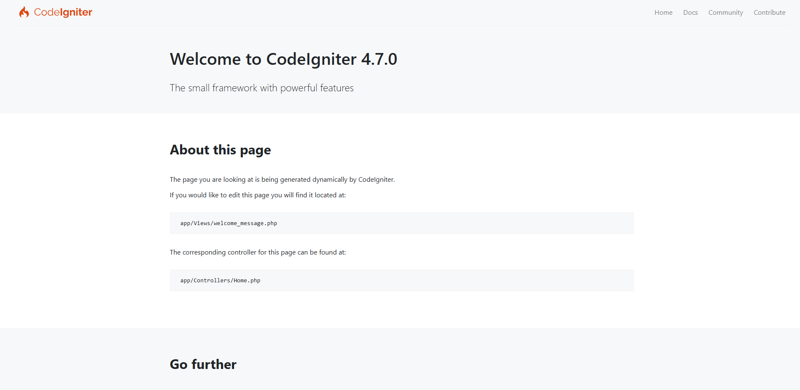
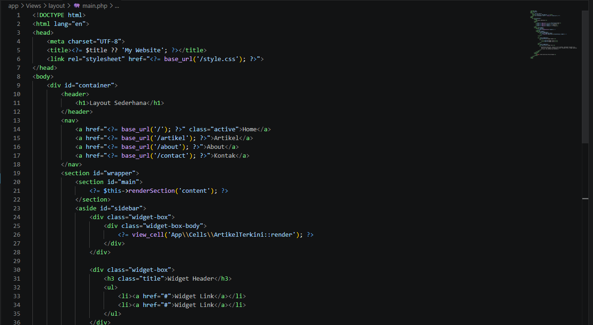
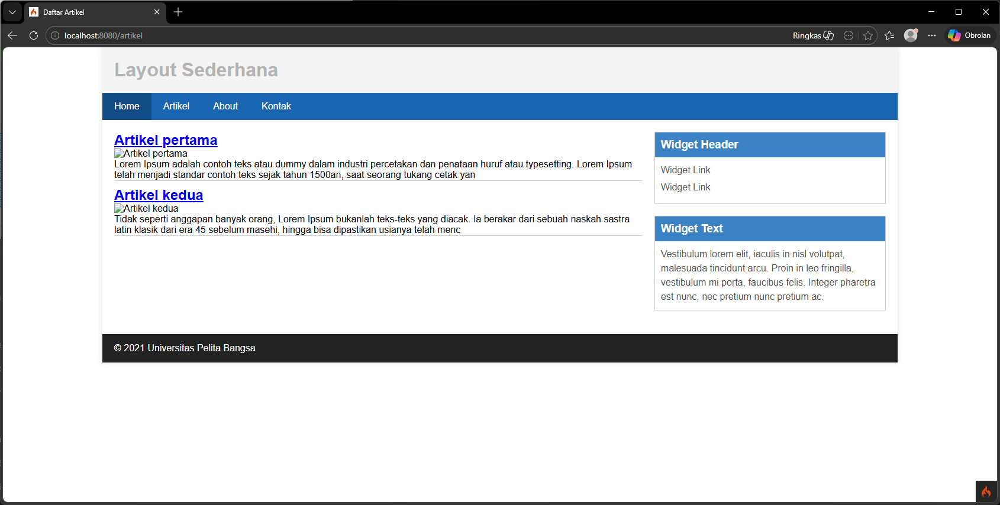

# LAPORAN AKHIR PRAKTIKUM
## PEMROGRAMAN WEB 2 (CI4 & VUEJS SPA)

```
NAMA  : FADHLUROHMAN FATIKH NAVINTINO
NIM   : 312210368
KELAS : I241E
DOSEN : Agung Nugroho, S.Kom., M.Kom.
PRODI : TEKNIK INFORMATIKA
UNIVERSITAS PELITA BANGSA
```

---

## 📑 PENDAHULUAN & LANDASAN TEORI

Laporan ini disusun sebagai rangkuman menyeluruh dari pelaksanaan praktikum mata kuliah **Pemrograman Web 2** sepanjang semester. Praktikum ini bertujuan untuk memberikan pemahaman teoritis dan keterampilan praktis dalam membangun aplikasi web modern berskala *enterprise*.

### 1. CodeIgniter 4 (MVC)
CodeIgniter 4 merupakan framework PHP yang menganut pola desain *Model-View-Controller* (MVC). MVC memisahkan logika bisnis (Model), logika presentasi (View), dan logika kontrol (Controller) guna mempermudah pemeliharaan sistem.

### 2. RESTful API
REST (Representational State Transfer) merupakan arsitektur komunikasi data stateless berbasis protokol HTTP. Endpoint API menyajikan data terstandardisasi dalam format JSON yang dapat dikonsumsi oleh berbagai client frontend.

### 3. Single Page Application (SPA) & VueJS 3
SPA merupakan pendekatan web modern di mana seluruh interaksi pengguna berjalan dalam satu halaman HTML dinamis tanpa perlu memuat ulang peramban secara penuh. VueJS 3 (diintegrasikan melalui CDN) dipadukan bersama Vue Router untuk navigasi client-side, dan Axios sebagai HTTP client untuk komunikasi data asinkron.

---

## 🛠️ PANDUAN PENGOPERASIAN SISTEM

### 1. Cara Menjalankan Backend CI4
Pastikan lingkungan server lokal (Apache & MySQL) aktif di XAMPP. Eksekusi perintah di bawah pada terminal root project:
```bash
cd C:\xampp\htdocs\praktikumweb2
php spark serve
```
Backend berjalan pada: `http://localhost:8080`

### 2. Cara Mengakses Frontend SPA
Akses halaman frontend melalui browser dengan URL berikut:
```text
http://localhost/praktikumweb2/lab8_vuejs/index.html#/
```

### 3. Kredensial Admin Pengujian
- **Username / Email:** `admin`
- **Password:** `admin123`

---

## 📂 STRUKTUR DIREKTORI PROJECT

```text
praktikumweb2/
├── app/                  # Kode utama backend (MVC)
│   ├── Controllers/      # Logika pemrosesan requests
│   ├── Filters/          # Middleware (Auth & API Token)
│   ├── Models/           # Struktur data & Query Builder
│   └── Views/            # Layouting & templates (Server-side)
├── lab8_vuejs/           # Client Frontend SPA (Client-side)
│   ├── index.html        # Entrypoint SPA
│   └── assets/           # CSS & Komponen JavaScript (Home, Artikel, About, Login)
├── file/                 # Berkas referensi modul
├── gambar/               # Galeri dokumentasi & aset
├── public/               # Root publik (Web server entry, CSS & jQuery)
└── README.md             # Dokumen panduan
```

---

## 📖 PEMBAHASAN MATERI PRAKTIKUM (BAB I - IV)

### BAB I: SETUP AWAL & DASAR FRAMEWORK (Praktikum 1 - 3)
* **Deskripsi:** Mempersiapkan lingkungan kerja CodeIgniter 4, konfigurasi mode pengembangan melalui `.env`, serta mempelajari alur request MVC.
* **Layouting & View Cell:** Membuat master template (`layout/main.php`) untuk header, footer, dan sidebar. Menampilkan daftar artikel terkini di sidebar menggunakan widget View Cell secara asinkron.
* **Hasil Visual:**
  <details>
  <summary>🔍 Klik untuk melihat Dokumentasi Bab I</summary>
  <br>
  - Halaman Selamat Datang CI4:
    
  - Halaman Layout Awal:
    
  - Source Code Layouting:
    
  - Widget Sidebar Artikel Terkini:
    
  </details>

### BAB II: CRUD ARTIKEL, DATABASE RELASIONAL & MEDIA (Praktikum 4 - 7)
* **Deskripsi:** Membangun antarmuka pengelolaan data artikel (Create, Read, Update, Delete) yang terhubung ke database `lab_ci4` melalui `ArtikelModel.php`.
* **Relasi Tabel & Upload Gambar:** Menghubungkan entitas artikel ke tabel kategori (one-to-many) menggunakan Query Builder. Formulir ditambahkan input unggah file gambar yang otomatis disimpan ke folder `public/gambar` dan dihapus dari penyimpanan jika data artikel dihapus.
* **Pagination & Pencarian:** Mengaktifkan pencarian judul artikel dinamis dan pemisahan data per halaman (pagination).
* **Hasil Visual:**
  <details>
  <summary>🔍 Klik untuk melihat Dokumentasi Bab II</summary>
  <br>
  - Tampilan Model Artikel (PHP):
    
  - Halaman List Artikel Publik:
    
  - Halaman Pencarian & Pagination:
    
  - Tampilan Dropdown Kategori di Form:
    
  - Relasi Kategori di Halaman Publik:
    
  - Struktur Tabel database di phpMyAdmin:
    
    
  - Form Tambah / Upload Gambar:
    
  </details>

### BAB III: AUTENTIKASI LOKAL & INTEGRASI AJAX (Praktikum 8)
* **Deskripsi:** Memperkenalkan sistem autentikasi admin di backend menggunakan session PHP. Sesi login dikontrol menggunakan middleware filter `auth`. Ditambahkan pula dashboard admin interaktif menggunakan AJAX jQuery sehingga modifikasi artikel tidak memerlukan refresh halaman penuh.
* **Hasil Visual:**
  <details>
  <summary>🔍 Klik untuk melihat Dokumentasi Bab III</summary>
  <br>
  - Halaman Form Login Sesi Admin:
    
  - Panel Admin Terproteksi Session:
    
  - Dashboard AJAX Real-time:
    
  </details>

### BAB IV: RESTFUL API & SINGLE PAGE APPLICATION VUEJS (Praktikum 10 - 14)
* **Deskripsi:** Mengubah backend menjadi penyedia data RESTful API JSON menggunakan ResourceController (`app/Controllers/Post.php`). Pada client-side, SPA VueJS 3 dikembangkan untuk menangani navigasi menggunakan Vue Router dan pertukaran data asinkron dengan REST API menggunakan Axios.
* **Sistem Keamanan Token**: Mengaktifkan Bearer Token di filter `ApiAuthFilter.php` backend untuk melindungi operasi penulisan data. Di client-side, Axios Interceptors menyisipkan token otomatis dari `localStorage` dan menangani *session expired* (response 401 Unauthorized) untuk auto-logout.
* **Hasil Visual:**
  <details>
  <summary>🔍 Klik untuk melihat Dokumentasi Bab IV</summary>
  <br>
  - Halaman Dashboard CRUD SPA VueJS:
    
  - Halaman Utama SPA VueJS:
    
  - Halaman About SPA (Profil Mahasiswa):
    
  - Form Login SPA VueJS:
    
  </details>

---

## 📝 KESIMPULAN

Melalui pengerjaan praktikum Pemrograman Web 2 ini, mahasiswa berhasil mengimplementasikan alur siklus pengembangan web modern dari sisi backend (CodeIgniter 4) dan frontend (VueJS 3 SPA). Integrasi REST API yang aman dengan otentikasi Bearer Token dan interaksi frontend asinkron berhasil dicapai, yang membuktikan kesiapan sistem untuk digunakan dalam skenario produksi nyata.